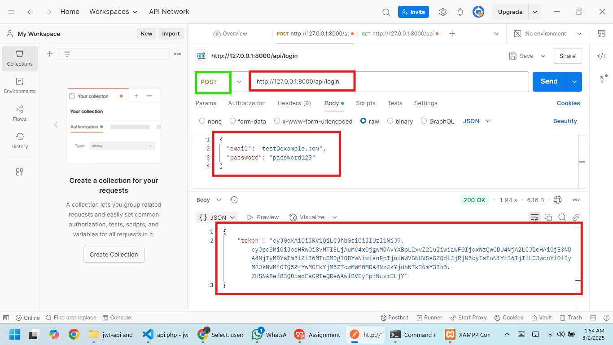
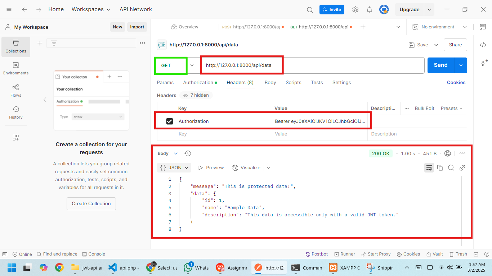

# Laravel API with JWT Authentication

This is a simple Laravel-based RESTful API that demonstrates JWT (JSON Web Token) authentication. The API allows users to log in, receive a JWT token, and access protected data using the token.

---

## Features
- User authentication using JWT.
- Protected endpoint to fetch data.
- Built with Laravel and the `tymon/jwt-auth` package.

---

## Requirements
- PHP >= 8.0
- Composer
- Laravel >= 9.x
- MySQL (or any other supported database)

---

## Screenshoots

### Image-1

### Image-2

